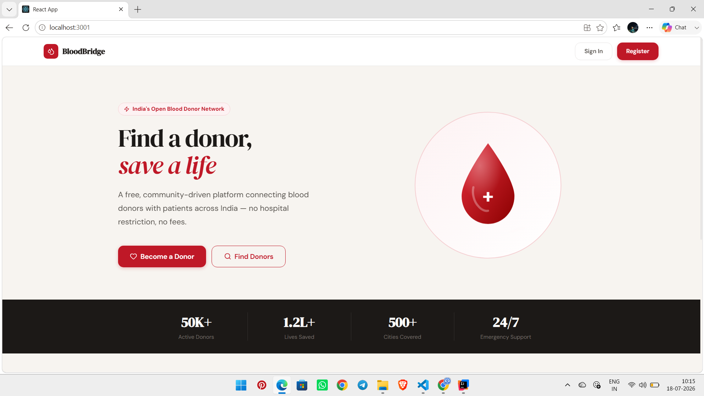
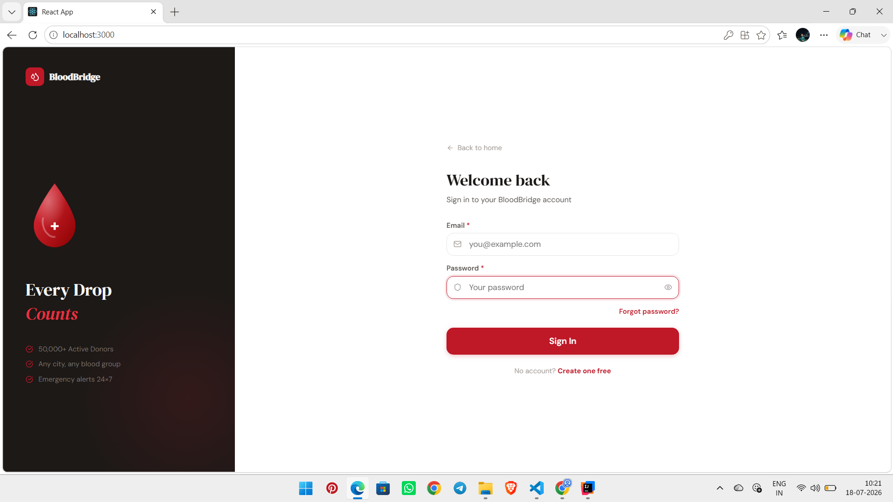
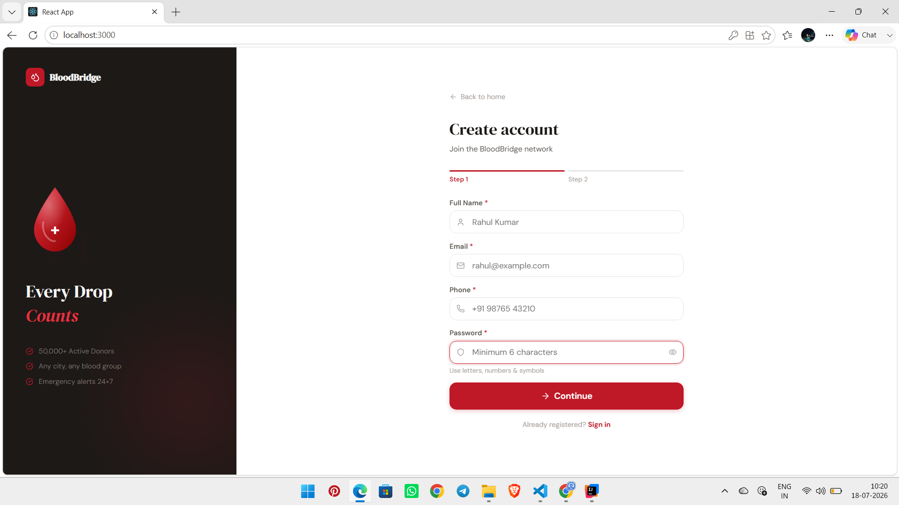
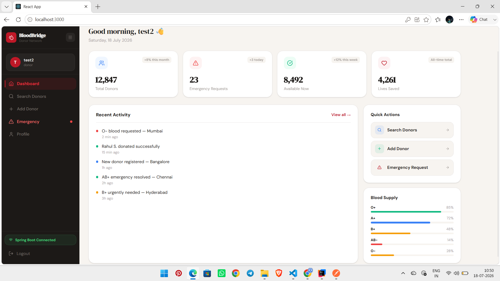
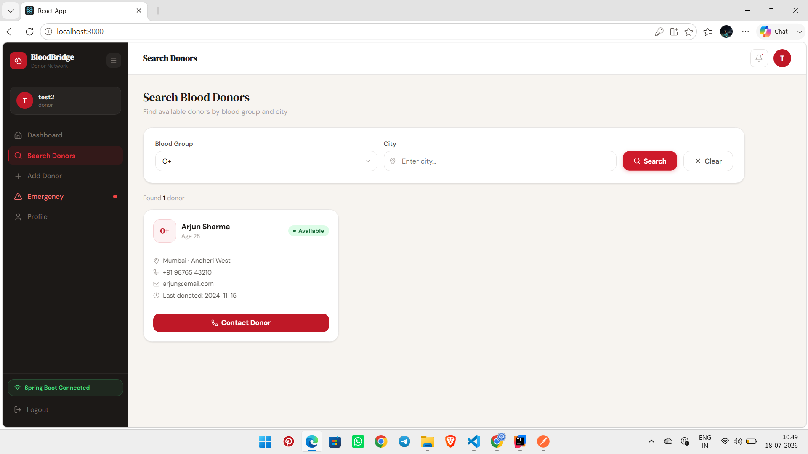
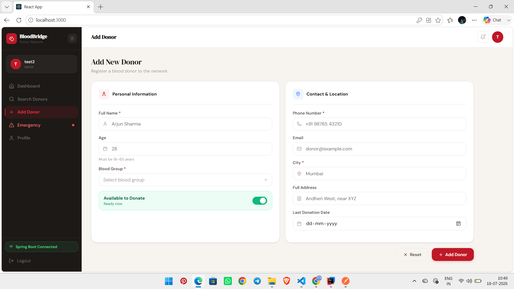
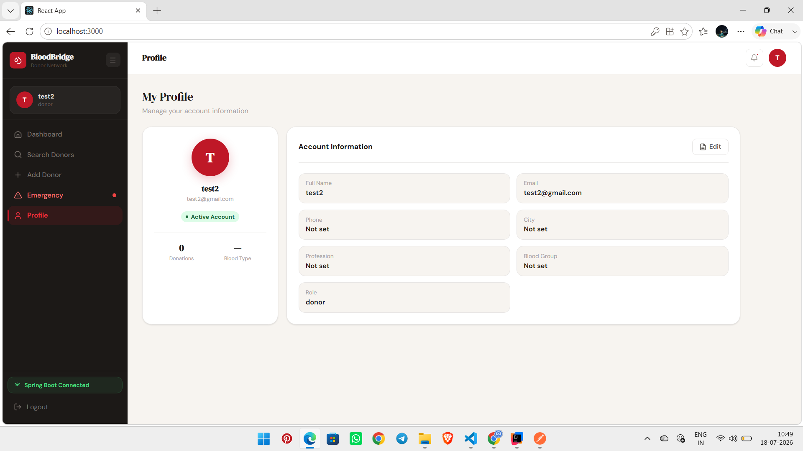

# BloodBridge — Donor Network

**India's Open Blood Donor Network** — A free, community-driven platform connecting blood donors with patients across India, with no hospital restrictions and no fees.



---

##  About

BloodBridge helps people find and register blood donors quickly during emergencies. It has two parts:

- **Public landing site** — homepage, sign in, sign up
- **Donor dashboard** — search donors, add donors, track blood availability, handle emergencies, manage profile

The backend is built with **Spring Boot** and secured using **JWT (JSON Web Token) authentication**.

---

##  Features

-  **JWT-based authentication & authorization** — secure login/signup, protected routes, and role-based access (e.g. `donor` role)
-  **Search Donors by Blood Group & City** — find available donors instantly by selecting a blood group and entering a city
-  **Add Donor** — register new donors with personal info, blood group, contact & location details
-  **Dashboard** — total donors, emergency requests, availability, lives saved, blood supply overview
-  **Emergency Requests** — flagged urgent blood needs with real-time notification indicator
-  **Profile Management** — view/edit account info (name, email, phone, city, profession, blood group, role)
  

---

##  Screens

| Screen | Preview |
|---|---|
| Homepage |  |
| Sign In |  |
| Sign Up |  |
| Dashboard |  |
| Search Donors |  |
| Add Donor |  |
| My Profile |  |

---

##  Search Donors

Users can search the donor network using two filters:

- **Blood Group** — dropdown (e.g. O+, A+, B+, AB−, O−, etc.)
- **City** — free text input

Results show donor name, age, blood group, availability status, location, phone, email, last donation date, and a **Contact Donor** action.

---

##  Security

- Authentication implemented with **JWT (JSON Web Token)**
- Token issued on successful login/signup and used to authorize subsequent API requests
- Protected routes on the backend (Spring Boot) validate the token before returning donor data
- Passwords require a minimum of 6 characters with letters, numbers & symbols
- Role-based access (e.g. `donor`) shown on user profile

---

## 🛠️ Tech Stack

| Layer | Technology |
|---|---|
| Frontend | React |
| Backend | Spring Boot (REST API) |
| Auth | JWT (JSON Web Token) |
| Local Ports | `3000` (dashboard app), `3001` (public site) |

---

##  Getting Started

```bash
# Clone the repository
git clone <your-repo-url>
cd bloodbridge

# --- Backend (Spring Boot) ---
cd backend
./mvnw spring-boot:run
# Runs on http://localhost:8080 (update if different)

# --- Frontend ---
cd frontend
npm install
npm start
# Dashboard app: http://localhost:3000
# Public site:   http://localhost:3001
```

> Update the above commands/ports to match your actual project structure.

---


##  Navigation (Sidebar — Dashboard App)

- Dashboard
- Search Donors
- Add Donor
- Emergency 
- Profile
- Logout

---


| Add Donor | `screenshots/addnewdonor.png` |
| My Profile | `screenshots/myprofile.png` |

---

*Built to make finding blood donors faster and easier — every drop counts.*
